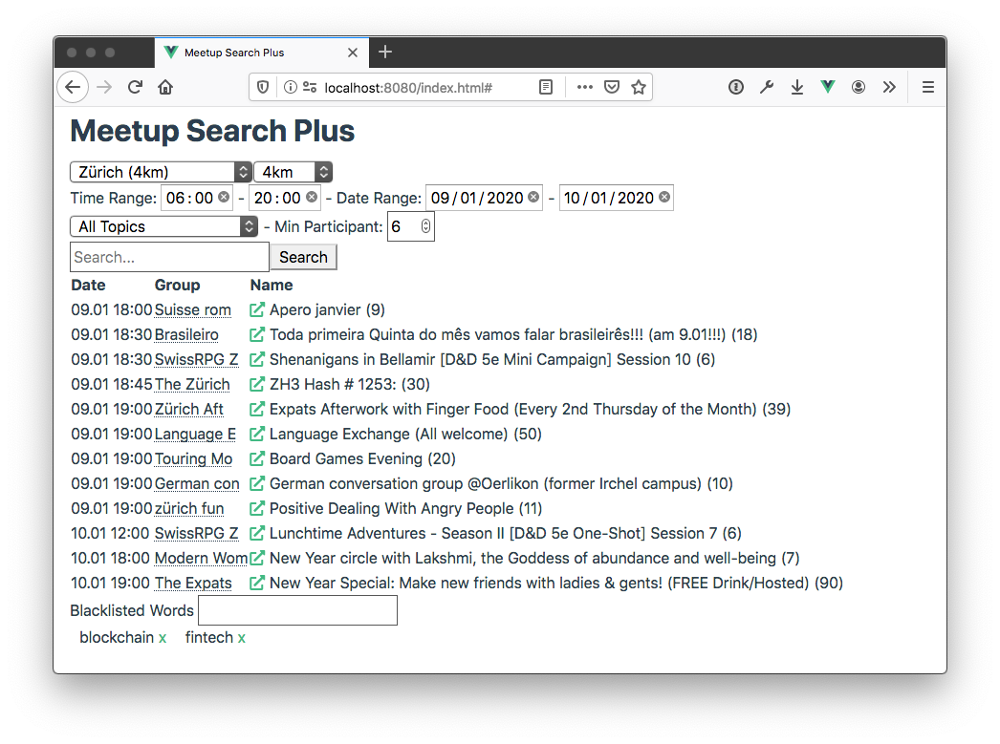

# Meetup Search Plus

Better UI to search for meetups.

## Features which meetup.com does not have
* Filter events by start time so you find afterwork events easier.
* Filter events by number of participants.
* Filter events you already RSVP.
* filter events containing bad words like: blockchain.

## TODOS
* filter by excluded_groups
* better design
* check when event is full rsvpable
* group events by day

## Notes on Meetup API
* radius parameter takes only values rounded to 0.5
* find/topic_categories is not sorted by locale
* page parameter is a maxiumum of results shown, not minimum

